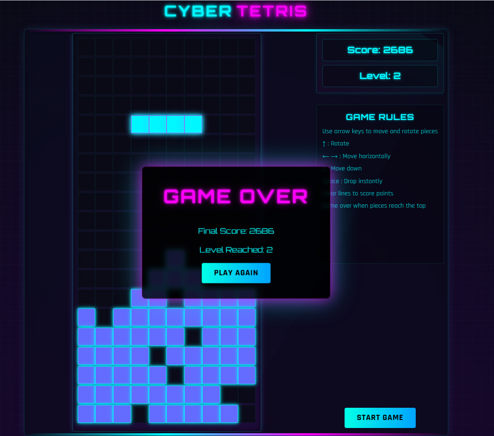

# 🎮 CyberTetris

A modern web-based implementation of the classic Tetris game with a cyberpunk aesthetic.

<div align="center">
  <a href="https://cybertetris.trauchessec.fr/" target="_blank">
    
  </a>
  
  <p>
    <a href="https://reactjs.org/">
      
    </a>
    <a href="https://www.typescriptlang.org/">
      
    </a>
    <a href="https://redux-toolkit.js.org/">
      
    </a>
    <a href="https://vitejs.dev/">
      
    </a>
  </p>

  
</div>

## ✨ Features

- Classic Tetris gameplay mechanics with modern cyberpunk aesthetic
- Responsive design for desktop and mobile play
- High score tracking
- Performance optimized with Redux Toolkit

## 🛠️ Tech Stack

- **Frontend:** React, TypeScript, CSS Modules
- **State Management:** Redux Toolkit
- **Build:** Vite

## 🏁 Getting Started

```bash
# Clone and install
git clone <your-repo-url>
cd CyberTetris
npm install

# Development
npm run dev

# Production build
npm run build
```

## 📁 Project Structure

```
CyberTetris/
├── src/
│   ├── components/       # UI components
│   ├── constants/        # Game constants like tetrominos
│   ├── hooks/            # Custom React hooks
│   ├── store/            # Redux store and slices
│   ├── types/            # TypeScript type definitions
│   ├── App.tsx           # Main application component
│   └── main.tsx          # Application entry point
```

## 📜 License

MIT 